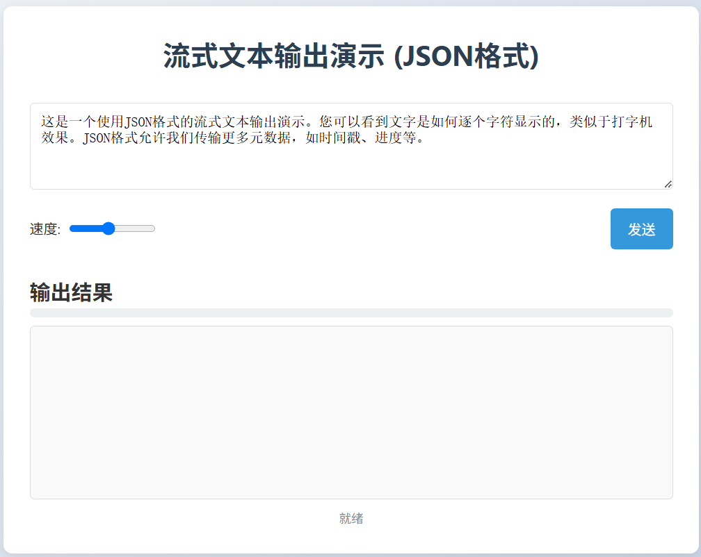

# 文本生成服务模拟

## 简介

- 使用 `Flask` 和 `FastAPI` 编写后端，实现文本的流式输出（模拟大模型输出）。做一个前端的简单界面，包含一个输入框可以输入一长条文本，有一个发送按钮，下方再有一个文本展示框，点击按钮，把输入的文本逐个字的从文本展示框显示出来，如下：

## 摘要

- 分别使用 `Flask` 和 `FastAPI` ，实现文本流式输出，模拟大模型的推理；
- 使用 `docker-compose` 启动多个服务；
- 使用 `Nginx` 做反向代理和负载均衡。

## 运行

- 启动 Flask 后端服务

进入 `flask_serve` 目录，按照 `README` 执行

- 启动 FastAPI 后端服务

进入 `fastapi_serve` 目录，按照 `README` 执行

